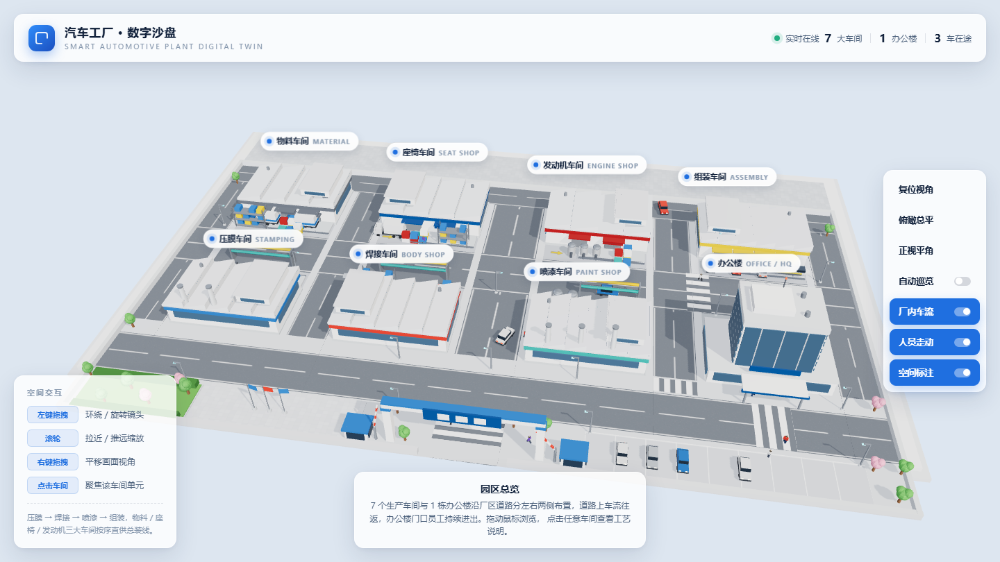
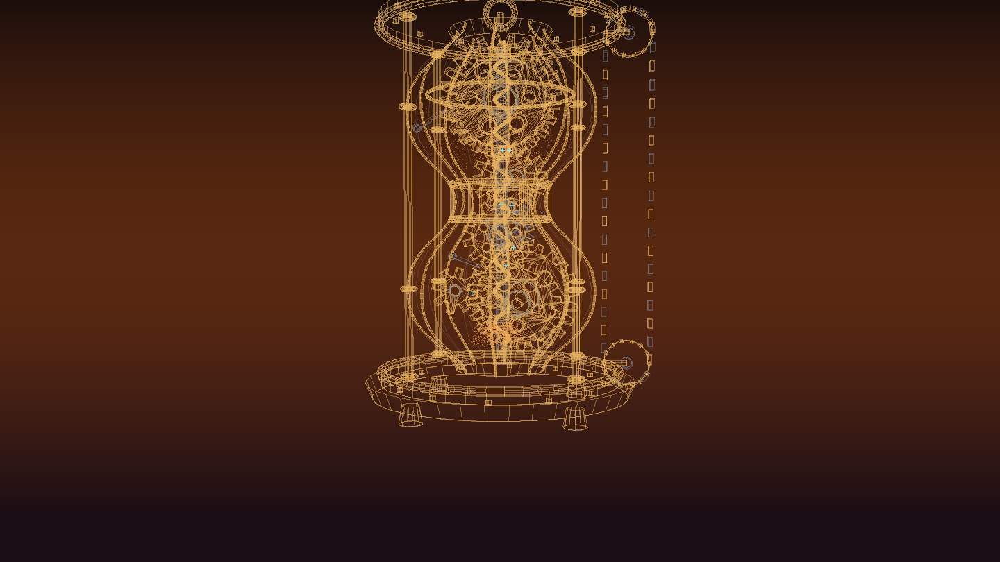
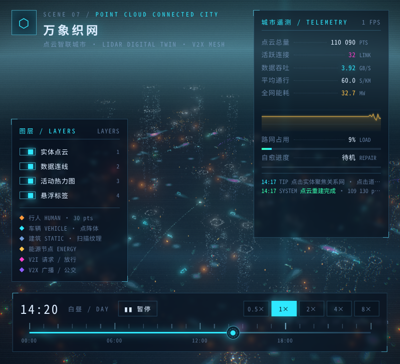

# 万物联动 · 多场景可视化站点（Everything Connected）

一个 Vite 多页工程，承载 7 个 three.js / WebGPU 可视化场景：**万物联动**（AIoT 数字孪生世界）、
**万里科技园**（汽车工厂三维数字沙盘）、**数智能源管理平台**、**晶体共振矩阵**、**逆时空齿轮轴**、
**纠缠之隙**（量子跃迁观测台）、**万象织网**（点云智联城市）。
各页面共用顶部胶囊导航（`src/components/SiteNav.jsx`），构建产物统一落在 `dist/`。

---

## 万里科技园 · 汽车工厂三维数字沙盘（Smart Automotive Plant Sandbox）

用 **Vite 8 + React 19 + three.js 0.186** 搭建的汽车工厂数字沙盘：**7 个生产车间 + 1 栋现代化玻璃幕墙办公楼**，
按厂区道路分左右两侧布置，道路上有 **3 台车往返行驶**，办公楼门口 **员工持续进出**。
点击任意车间可**掀开屋顶**观看内部产线：机械臂加工（焊接车间带焊花）、AGV 驮料出入库、输送线料箱循环。
大门门楼悬挂「万里科技园」双面发光名牌，办公楼顶层设「万物联动」发光标识，园区四周为金属镂空栅栏围墙。



## 运行

```bash
cd smart-factory-sand-plate
npm install     # 依赖已安装，可跳过
npm run dev     # http://127.0.0.1:5188/
npm run build   # 产物在 dist/
npm run preview # 本地预览构建产物（ES module 不能用 file:// 直接打开，需 HTTP 服务）
```

## 页面与导航

| 页面 | 开发地址 | 说明 |
| --- | --- | --- |
| 首页 · 万物联动 | http://127.0.0.1:5188/ | WebGPU 驱动的 AIoT 数字孪生世界（入口，含顶部导航胶囊菜单） |
| 万里科技园 | http://127.0.0.1:5188/park/index.html | three.js 汽车工厂三维数字沙盘（浅色 HUD，可掀顶看产线） |
| 数智能源管理平台 | http://127.0.0.1:5188/energy/index.html | three.js + ECharts 的 3D 能源看板，原 `rilland-scada/demo/03` |
| 晶体共振矩阵 | http://127.0.0.1:5188/crystal/index.html | 克莱因蓝玻璃晶体能量环（鼠标视差 + 点击涟漪共振） |
| 逆时空齿轮轴 | http://127.0.0.1:5188/gears/index.html | 废土机械时序沙漏，拖动拨轮驱动齿轮组咬合 |
| 纠缠之隙 | http://127.0.0.1:5188/quantum/index.html | 量子跃迁观测台：纠缠粒子 + 能量弦 + 能级跃迁 + 贝尔不等式测试（单文件页面，CDN 引 three/gsap） |
| 万象织网 | http://127.0.0.1:5188/city/index.html | 点云智联城市：数十万点数字孪生城区 + V2X 数据连线 + 事故自愈推演（单文件页面，CDN 引 three/gsap） |

顶部导航菜单（`src/components/SiteNav.jsx`）负责页面间跳转，`NAV_ITEMS` 里加一项即可新增页面；
它会按当前路径自动把链接基准在 `./` 与 `../` 之间切换，因此根目录页与子目录页共用同一份组件。
`energy` / `crystal` / `gears` / `quantum` / `city` 是非 React 页面，在各自 HTML 里内联了同款胶囊导航
（energy 页沿用左上角「返回万物联动」入口）。
七个页面都已配置进 Vite 多页构建，产物分别落在 `dist/index.html`、`dist/park/index.html`、`dist/energy/index.html`、
`dist/crystal/index.html`、`dist/gears/index.html`、`dist/quantum/index.html`、`dist/city/index.html`。

## 鼠标交互

| 操作 | 效果 |
| --- | --- |
| 滚轮 | 缩放（视距 6 ~ 96 钳制） |
| 左键拖拽 | 环绕旋转镜头 |
| 右键拖拽 | 沿地平面平移 |
| 点击车间 / 标签 | 镜头缓动飞向该车间并掀开屋顶，观看内部产线 |

`screenSpacePanning = false`（沿地平面平移，符合沙盘观感）；`maxPolarAngle ≈ 87.6°` 防止镜头穿到展台下方；
拖拽超过 6px 判定为旋转而非点击。支持机位分享：`?view=hero|top|side|close` 或 `?cam=x,y,z&target=x,y,z`。

## 总平面布局

园区 36.6 × 20.4（沙盘单位），**4 列 × 2 排共 8 栋建筑**，路网把厂区切成左右两侧：

```
                        ← x 向 36.6 →
  ┌──────┬──────┬──────┬──────┬──────┬──────┬──────┬──────┬──────┐
  │左环路│物料  │ 道路 │座椅  │ 道路 │发动机│ 道路 │组装  │右环路│   背排（z≈-3.15）
  └──────┴──────┴──────┴──────┴──────┴──────┴──────┴──────┴──────┘
  ══════════════ 背侧道路（z = -5.8）═══════════════════════════════
  ── 硬质作业面（卸货 / 停放，z ∈ [-1.5, -0.1]）──
  ══════════════ 中央横向主路（z = 1.4，宽 3.0）═════════════════════
  ── 硬质作业面（卸货 / 停放，z ∈ [2.9, 4.3]）──
  ┌──────┬──────┬──────┬──────┬──────┬──────┬──────┬──────┬──────┐
  │左环路│压膜  │ 道路 │焊接  │主干道│喷漆  │ 道路 │办公楼│右环路│   前排（z≈5.95）
  └──────┴──────┴──────┴──────┴──────┴──────┴──────┴──────┴──────┘
  ══════════════ 厂前道路（z = 9.8）═══════════════════════════════
  ── 厂前区：广场 / 旗杆 / 大门门楼 / 停车场（z ∈ [11.0, 13.6]）──
```

- **纵向道路 5 条**：左右两侧环路（x = ±17.3）+ 车间之间的分隔道路（x = ±8.9）+ 中央主干道（x = 0，宽 3.0，直通大门）。
- **横向道路 3 条**：背侧道路、中央横向主路（所有车间大门都开向它）、厂前道路。
- 每个车间四周都有道路、互不贴邻；左右两侧各 4 栋，形成明确左右分区。
- 厂区四周设**金属镂空栅栏围墙**（竖杆实例化渲染），正面对应中央主干道留出大门开口。
- **车道净空约束**：路灯、管廊、货架、挡车块等全部位于人行道 / 硬质作业面，任何车辆行驶路径上不放静态障碍物。
- 路面为程序化**高仿真柏油贴图**（底色斑驳 + 粗细骨料 + 裂缝 + 车辙磨损 + 边线 / 中心虚线 + bump 颗粒起伏）。

## 七大车间 + 办公楼

| 位置 | 建筑 | 说明 |
| --- | --- | --- |
| 前排 C1 | 压膜车间 | 覆盖件冲压成型；钢卷堆场 + 管廊 |
| 前排 C2 | 焊接车间 | 白车身焊装线；料架 + 箱区 |
| 前排 C3 | 喷漆车间 | 涂装 / 烘干；储罐 + 管廊 + 3 根排气管 |
| 前排 C4 | 办公楼 | 全玻璃幕墙现代塔楼（首层到顶层等截面，幕墙反射环境光影），顶层「万物联动」发光标识，员工进出集散点 |
| 背排 C1 | 物料车间 | 集配 / 线边仓储；货架 + 箱区 + 2 台货车 |
| 背排 C2 | 座椅车间 | 座椅总成；箱区 + 货架 |
| 背排 C3 | 发动机车间 | 动力总成；储罐组 + 箱区 |
| 背排 C4 | 组装车间 | 整车总装线；门前输送线上车体持续流动 + 下线整车停放 |

车间统一为「白墙 + 彩色腰线 + 锯齿采光屋面 + 卷帘卸货门 + 屋顶控制室」，以腰线颜色区分工艺单元；
地面硬质作业面上绘制黄色工艺流向箭头（压膜 → 焊接 → 喷漆 → 组装）。

## 车间内部产线（点击掀顶可见）

每个车间内部都建有产线模型，点击车间 / 标签后镜头飞向大门一侧高位并掀开屋顶：

- **机械臂 × 2**：底座回转 + 肩 / 肘 / 腕联动，持续做加工作业；焊接车间带蓝白焊花闪烁
- **AGV 无人搬运车**：驮着料箱沿「大门 ⇄ 输送线」矩形环线出入库，车头青色示廓灯
- **输送线**：料箱循环流动；线边立式货架做入库暂存
- 复位视角 / 俯瞰 / 正视或点击其他区域时屋顶自动还原

## 车辆（最多 3 台，道路上往返行驶）

3 台车各自沿**闭环车道**行驶：去程走一侧车道 → 端部半圆掉头 → 回程走另一侧车道（右行规则），
车头朝向按切线平滑插值，车轮同步自转。

1. 白色轿车 —— 中央主干道（x = 0），z ∈ [-5.6, 10.6]
2. 蓝色轿车 —— 中央横向主路（z = 1.4），x ∈ [-16.8, 16.8]
3. 红色轿车 —— 组装 / 喷漆之间的纵向道路（x = 8.9）

另有静态停放的 4 台轿车（写字楼前停车场）与 3 台厢式货车（车间卸货面），不参与行驶。

## 人员（不断从办公楼进出）

12 名员工沿 5 条闭合动线行走，起点 / 终点都设在写字楼门内，因此形成「走出门 → 办事 → 返回进门」的持续循环：

- **A** 办公楼 ⇄ 停车场（穿厂前道路斑马线）
- **B** 办公楼 ⇄ 大门广场（过中央主干道斑马线到广场）
- **C** 办公楼 ⇄ 组装车间（沿纵向道路人行道，过中央横向主路斑马线）
- **D** 中央主干道人行道通勤
- **E** 背排车间之间人行通勤

行走时腿、臂反相摆动，身体随步频轻微起伏；步频与位移绑定（步长约 1.4 m 当量）。

## 源码结构

```
smart-factory-sand-plate/
├── index.html                                万物联动入口（React + WebGPU）
├── park/index.html                           万里科技园入口（React + three.js 沙盘）
├── energy/ · crystal/ · gears/ · quantum/ · city/  其余五个场景页面
├── vite.config.js · package.json
├── preview/                                  渲染预览图
└── src/
    ├── main.jsx · App.jsx · styles.css       万物联动入口与深色 HUD 样式（含站点导航 .ec-sitenav）
    ├── components/SiteNav.jsx                站点级胶囊导航（NAV_ITEMS 数据驱动）
    ├── components/Sandbox.jsx                沙盘 React 容器 + HUD（视角 / 车流 / 人流 / 标注开关）
    ├── park/
    │   ├── main.jsx                          沙盘页面入口：SiteNav + Sandbox
    │   └── styles.css                        沙盘浅色 HUD 样式（后引入，覆盖站点深色底）
    ├── world/ · world/shaders/*.wgsl         万物联动 WebGPU 世界与着色器
    ├── crystal/ · gears/                     其余场景实现（quantum、city 为单文件页面，实现内联在各自 index.html）
    └── three/
        ├── palette.js                        配色板（含车辆、人物、道路色）
        ├── builders.js                       构件工厂：车间 / 写字楼 / 车辆 / 行人 / 路灯 / 门卫室 / 堆场…
        └── createSandbox.js                  总平面装配 + 路网贴图 + 车流与人流路径 + 交互 + 渲染循环
```

> 沙盘页是站内唯一的浅色主题页面：`src/park/styles.css` 在 `src/styles.css` **之后**引入，
> 用浅色变量覆盖 `html/body/#root` 的底色，并把顶部 HUD 下移到 88px 给胶囊导航让位。

路网使用程序化 Canvas 贴图（沥青颗粒 + 边线 + 中心虚线）平铺，避免大量小面片带来的 draw call 开销；
斑马线、停车位划线、地面流向箭头同为贴图面片。

## 站点场景入口

同一个 Vite 工程下的多页面场景，构建产物位于 `dist/`：

| 页面 | 路径 | 说明 |
| --- | --- | --- |
| 万物联动 | `index.html` | WebGPU 驱动的 AIoT 数字孪生世界 |
| 万里科技园 | `park/index.html` | 汽车工厂三维数字沙盘（浅色 HUD；7 车间 + 办公楼，点击掀顶看产线） |
| 数智能源管理平台 | `energy/index.html` | 能源产消/储能/负荷监控大屏 |
| 晶体共振矩阵 | `crystal/index.html` | 克莱因蓝玻璃晶体能量环（鼠标视差 + 点击涟漪共振） |
| 逆时空齿轮轴 | `gears/index.html` | 废土机械时序沙漏，拖动拨轮驱动齿轮组咬合 |
| 纠缠之隙 | `quantum/index.html` | 量子跃迁观测台（自包含单文件：CDN 引 three/gsap + 内联模块脚本） |
| 万象织网 | `city/index.html` | 点云智联城市数字孪生（自包含单文件：CDN 引 three/gsap + 内联模块脚本） |

`park/` 的实现要点：

- 沙盘本体仍在 `src/three/*`（`builders.js` / `createSandbox.js` / `palette.js`）与 `src/components/Sandbox.jsx`，
  页面只是把它们重新挂回一个独立入口，万物联动首页不受影响。
- 门楼名牌「万里科技园」在 `src/three/createSandbox.js` 的 `B.gateArch({ name: '万里科技园' })`（`builders.js` 默认值同名）。

`crystal/` 的实现要点：

- `src/crystal/main.js` — 场景主体：`MeshPhysicalMaterial`（transmission 1.0 / IOR 1.72 / clearcoat / iridescence）
  玻璃材质 + `RoundedBoxGeometry` 实例化晶体环 + 程序化 PMREM 环境 + UnrealBloom 霓虹泛光；
  导出 `buildCrystalCells` / `updateCrystalMatrices` / `rippleEnvelope` 等纯函数，便于单测。
- `crystal/app.js` — DOM 绑定层（HUD 数值、光标光晕、加载遮罩），页面以相对路径引用它，
  因此 `npm run dev`、`npm run build`、直接双击打开（回退 CDN importmap）三种方式都能运行。
- 交互：鼠标在 z=0 平面的投影点作为 3D 指针坐标驱动环体倾斜与灯光重算；
  点击空白处生成水波纹（扩散 2 秒后严格归零收拢），最多叠加 3 条。
- 低端设备自适应：连续三次统计帧率 < 34 时自动关闭泛光并把采样降到 1x。
- 自检（不需要浏览器/WebGL）：`npm run check:crystal`，即 `scripts/check-crystal.mjs`，
  在 Node 中校验 three API、晶体排布、波纹包络收敛与实例矩阵复原。

---

## 逆时空齿轮轴（Scene 05 · Wasteland Gear Core）

废土科幻朋克风的机械时序沙漏：页面中央是垂直立体的 3D 机械沙漏，玻璃罩内前后两层齿轮
相互咬合；底部正中是图形化「倒转」拨轮，拖动拨轮时 3D 齿轮组按**等比例**顺时针/逆时针转动，
火花自齿隙散落；拨轮反向拨动时**流沙逆行回舱**——时间只在齿轮转动时流动。



打开：http://127.0.0.1:5188/gears/index.html

### 交互

| 操作 | 效果 |
| --- | --- |
| 拖动底部拨轮 | 拨轮 1:1 跟手；阻尼（Easing）后的角速度实时驱动齿轮组转角，速度/方向成比例 |
| 松手 | 飞轮惯性：速度越大，`power3.out` 衰减越久 |
| 点击拨轮中心「倒转」/ 空格 | GSAP 时间线把阻尼值推到负向极速再回落，流沙倒流、镜头轻抖、冷色闪白 |
| ← / → 或 A / D | 点动驱动（自动转一小段后停下） |
| 画布拖拽 / 滚轮 | 环绕视角 / 缩放（9~26 钳制），鼠标停 3 秒后镜头缓慢自动巡游 |

### 实现要点

- `src/gears/three/gear.js` — 程序化直齿齿轮几何（齿顶/齿根/减重孔，`ExtrudeGeometry` 倒角）。
  **咬合相位数学**：父轮 P、子轮 C 齿数 Np/Nc、连心线方位角 β，则
  `Np·(β−θp) + Nc·(β+π−θc) ≡ π (mod 2π)` 为「齿顶对齿槽」充要条件；
  由此解出各轮初始相位，并保证 `ωc = −(Np/Nc)·ωp`，任意转角下都精确咬合、永不穿模。
- `src/gears/three/hourglass.js` — 装配：玻璃罩（`LatheGeometry` 剖面 + 8 根黄铜经线肋）、
  上下法兰/四立柱/腰部镂空护圈/底座、中央蜗杆轴（螺旋 `TubeGeometry`）、前后双层齿轮系、
  棘爪（逐齿抬升—跌落）、擒纵叉（一次一齿摆动）、外置链传动（链节沿路径匀速流动）。
  旋转节点全部用 `THREE.Bone` 组成骨骼层级：`boneRoot → boneShaft / 各层齿轮骨 / 棘爪骨`。
- `src/gears/dial.js` — 拨轮：指针角位移直接写进拨轮角度，瞬时角速度经 EMA 平滑后用
  `gsap.to(..., { ease: 'power2.out' })` 逼近目标，松手用 `power3.out` 做惯性衰减；
  这个被 Easing 过的数值 `drive.omega` 就是驱动 3D 齿轮组的唯一输入（HUD 上报为「拖动阻尼」）。
- `src/gears/three/sand.js` — 可逆沙流：沙粒用固定身份值 `u` 与上舱余量 `F` 的纯函数定位
  （`A = u − F`：上舱 → 流束 → 沙堆），因此正流与倒流走同一条路径，完全可逆且无累积误差。
- `src/gears/three/sparks.js` — 火花从啮合点沿切向（`v = ω × r`）甩出，发射密度与啮合线速度成正比，
  颜色白热 → 橙 → 暗红；另在流沙落点补少量火尘。
- 光效：落日方向光 + 余晖轮廓光 + 程序化落日环境贴图（PMREM）+ 罩内暖光点光源 + UnrealBloom 泛光，
  ACESFilmic 色调映射；画面叠 CSS 暗角 / 胶片颗粒 / 扫描线，突出做旧黄铜质感。

### 自检（不需要浏览器 / WebGL）

```bash
npm run check:gears   # 咬合不变量、装配拟合（齿顶不穿玻璃、非啮合不穿模）、沙流可逆与连续性、300 帧主循环
npm run check:dial    # 用 DOM 桩模拟「按下→拖动→松手→倒转」，校验跟手、阻尼生成、惯性衰减、倒转时间线
npm run preview:gears # 无 WebGL 环境下的离线线框投影预览（输出 preview/gears-preview.png）
```

---

## 纠缠之隙：量子跃迁观测台（Scene 06 · Quantum Jump Observatory）

深空量子赛博风：近乎纯黑的深蓝紫背景下，中央悬浮一座**磨砂玻璃 + 全息线框**的量子观测舱
（舱壁带细密纵向刻度与角度标注、上下精密刻度环、底座极坐标网格台面），舱内上下两层联动：

- **量子纠缠区（上方两侧）**：一对发光的纠缠粒子 A / B 分置舱体两端，每个粒子由**自旋箭头 + 概率云
  （9000 点 GPU 点云）+ 辉光**构成；两者之间是**能量弦**——带状面片（正弦波位移 + 沿线流动脉冲）
  外套双向对流的粒子流。拖动 A 改变自旋方向，B **瞬时呈现相反自旋**（B 的箭头恒为 A 的反向），
  两侧同步产生镜像涟漪；拖动越快，能量弦的震颤频率与亮度越强。
- **量子跃迁区（中央下方）**：原子核（核子簇）+ **4 层同心能级轨道**（各自不同倾角）+ 沿当前能级运行的电子。
  底部正中是圆形**能量注入旋钮**（SVG，60 刻度 + 发光指针 + 进度弧），顺时针注入、逆时针泄能，
  注入量与**拖动角度、拖动速度**都成正比；能量达阈值时电子沿轨道**无过渡地闪现跃迁**并放出光子波包，
  能量回落则退回低能级并释放对应颜色的光子——**能级差越大，光子越偏蓝紫**（405 ~ 610 nm）。
- **观测者效应**：按住任意粒子，模糊的概率云在 **0.5s 内收缩成一个确定的亮点**，同时触发相位噪点与
  色差闪烁（后期 pass 的 `uNoise` / `uAberration` 尖峰）；松手后概率云缓慢重新弥散（2.6s）。
- **数据面板**：右上角实时显示自旋关联度 E(a,b)、测量基、能量弦震颤、当前能级与轨道半径、注入能量、
  光子释放计数与末次波长，以及**贝尔不等式测试**仪表（|S| 进度条 + 局域上限 2 与量子极限 2√2 标记 +
  历史迷你折线 + 结论文案）。多次测量后 |S| 会收敛到 ≈2.828。
- 背景：星尘点云 + 12 枚悬浮公式碎片（薛定谔方程、狄拉克符号、⟨ψ|φ⟩、|S| ≤ 2 < 2√2 …）。
- 悬停粒子 / 原子核 / 旋钮会弹出**科普小气泡**（"为什么这不是超光速通信"「关联 ≠ 信号」「跃迁为何是闪现」…）。

### 交互

| 操作 | 效果 |
| --- | --- |
| 拖动粒子 A / B | 设定自旋方向（水平 → 方位角，垂直 → 倾角）；B 恒取反向，能量弦扭转角随自旋角变化 |
| 按住粒子 | 波函数坍缩（0.5s），松开缓慢弥散；松开同时记一次联合测量 |
| 拖动底部旋钮 | 顺时针注入 / 逆时针泄能，注入量 ∝ 角度 × 速度（`gsap.quickTo` 阻尼平滑） |
| 滚轮（旋钮上）/ 点击原子核 | 微调能量 / 立即触发一次联合测量 + 相位闪烁 |
| 拖拽空白处 · 滚轮 | 环绕视角 / 缩放（自实现球坐标轨道，节流阻尼 + 鼠标视差） |
| 空格 · ↑ ↓ · R | 观测坍缩 · 注能/泄能 · 复位统计 |

### 实现要点

- **单文件交付**：整页就是一个 `quantum/index.html`（样式 + 内联 `<script type="module">`），
  通过 **importmap** 引 `three@0.186.0`（含 `three/addons/` 前缀映射）与 `gsap@3`，
  因此 `npm run dev`、`npm run build`（Vite 会把内联模块当虚拟模块打包）与 `file://` 直开都能运行。
- **着色器工厂 + 契约校验**：所有 GLSL 集中在 `SHADER_SPECS` 注册表（`uniforms` 清单 + vertex/fragment），
  材质一律用 `makeShaderMaterial(name, values)` 装配并断言 uniform 齐备；
  离线脚本再把 GLSL 里的 `uniform` / `varying` 声明与清单**双向交叉比对**（拼错名字即报错）。
- **配置集中**：`CONFIG` 里按 render / camera / entangle / atom / knob / collapse / bell / anim 分组，
  能级表 `LEVELS`（`need` = 跃迁阈值）与光子光谱 `PHOTON_SPECTRUM` 常量化，改数值不用翻代码。
- **纯逻辑可单测**：`/* ==== PURE-BEGIN ==== */ … PURE-END` 圈出的区域（配置 + 光子色相、能级跃迁迟滞、
  能量累积、震颤映射、贝尔 CHSH 统计）不含 three/gsap/DOM，可被 Node 直接抽取运行。
- **单帧零分配**：主循环（`gsap.ticker`）里复用 `TMP_V1/TMP_Q` 等临时对象与预分配池
  （涟漪池 12 个、光子波包 3 壳 + 2 环 + 1400 点复用），涟漪/光子均为事件驱动推进，不新建对象。
- **物理诚实**：贝尔测试的联合测量用自旋单态的正确分布 `P(±±) = ½sin²(Δ/2)`、`P(±∓) = ½cos²(Δ/2)`
  （⇒ `E(a,b) = −cosΔ`），四组 CHSH 设置 (a,a′)=(0°,90°)、(b,b′)=(45°,135°)，|S| 收敛到 2√2；
  自检脚本同时跑一个**局域隐变量模型**作对照，断言它不超过 2。
- **性能与适配**：像素比 ≤ 2；`gl_PointSize` 按 `设备高度/2 ÷ tan(fov/2)` 换算并分区给系数；
  低核数 / 小屏 / `prefers-reduced-motion` 自动降级（粒子数 ×0.45、关闭 transmission、降低泛光）。
- 后期：`EffectComposer + RenderPass + UnrealBloomPass + OutputPass + 自定义 ShaderPass`（色差 / 扫描线 /
  相位噪点 / 暗角）；注意 ShaderPass 传入普通 shader 对象会**深拷贝 uniforms**，故这里传 `ShaderMaterial` 以保持引用。
- 画面叠加 CSS 暗角 / 扫描线 / SVG 噪声颗粒 / 坍缩闪光层，配合 ACESFilmic 色调映射。

### 自检（不需要浏览器 / WebGL）

```bash
npm run check:quantum
```

`scripts/check-quantum.mjs` 校验：内联模块语法、8 组着色器的 uniform/varying 契约、31 个 HUD id 与
gsap 选择器在 HTML 中的存在性、importmap 对全部裸导入的覆盖与 CDN 版本一致性、vite 入口与各页面导航互链，
以及纯逻辑数值（光子色相单调偏冷、能级迟滞、能量累积上/下限、震颤映射、涟漪计数、
量子态 |S| 收敛到 2.828 / 局域模型 ≤ 2 / E(a,b) = −cosΔ / 同向概率 sin²(Δ/2)）。

---

## 万象织网：点云智联城市（Scene 07 · Point Cloud Connected City）



打开：http://127.0.0.1:5188/city/index.html

LiDAR 数字孪生风城市：十余万个三维点（缓冲上限 34 万静态点）构成的可自由旋转缩放城区，所有点云**程序化生成**，
不依赖任何外部模型或贴图。四类实体 + 一层数据交互网络：

- **建筑（钢蓝）**：按垂直扫描带 + 立面采样间距稀疏采样的扫描纹理点阵，中心商务区起数据信标塔，
  周期发射脉冲环（纯顶点着色器，零 CPU 开销）。
- **行人（暖橙）**：每人 30 点、四肢反相摆动的步行体，在人行道段内往返，悬浮 ID / 目的地标签。
- **车辆（电光青）**：点阵长方体（大客车用满 84 槽位）沿路网节点图行驶，带点状拖尾；
  红绿灯按南北 / 东西相位轮转，灯色随相位变化。
- **数据连线（核心）**：流动光点连线，按类型着色 —— 车→灯 V2I 通行请求（洋红）＋ 灯→车放行脉冲（绿）、
  行人↔站台↔公交到站时刻（紫）、建筑→电网能耗（琥珀）、电网→充电站能量包（绿）、事故 V2X 广播（红）。

### 交互

| 操作 | 效果 |
| --- | --- |
| 拖拽 / 滚轮 / 右键拖拽 | 环绕 / 缩放 / 平移（OrbitControls） |
| 点击实体 | 镜头飞至 50 m **关系聚焦**：相关连线高亮、其余点云衰减、弹出数据卡（状态 / 速度 / 连接数 / 负载 / 邻居） |
| 点击道路 | 生成**交通事故**：13 辆附近车收 V2X 广播并改道，涉事路口强制红灯 → 黄闪 → 逐步自愈，面板显示自愈进度 |
| 拖动底部时间刻度 | Sim 速度 + 昼夜（夜间点云变暗、数据流与热力图更亮） |
| 图层开关 1 / 2 / 3 / 4 | 实体点云 / 数据连线 / 活动热力图 / 悬浮标签 |
| 空格 · A · R · ← → · ESC | 暂停 · 随机事故 · 复位机位 · 时间进退 · 退出聚焦 |

### 实现要点

- **单文件交付**：整页就是一个 `city/index.html`，importmap 引 `three@0.186.0`（含 `three/addons/`），
  GSAP 走普通 script 标签；参数全部集中在 `CONFIG`（city / points / buildings / agents / links /
  traffic / sim / focus / accident / heat / colors / dataType 十一组，逐行注释）。
- **点云池化**：静态 / 动态 / 高亮 / 特效四个 `PointPool`（typed array + `DynamicDrawUsage` +
  `setDrawRange` + 固定 `boundingSphere`），每个池一次 draw call；点尺寸按距离衰减，`farCull` 做 LOD 剔除。
- **CPU 仿真写在 typed array 里**：车辆在路网图上转向（限转向角速度 + 跟驰 + 红灯排队 + 事故斥力改道），
  行人在人行道段上行走，每辆车环形缓冲拖尾。
- **连线全 GPU**：每条链路只存端点 `aA`/`aB`，二次贝塞尔 + UV 流动着色器画光点，链路池 84 条循环复用
  （生命周期推进必须先于任何提前返回，否则池满即冻结）。
- **后期**：`RenderPass → UnrealBloomPass`（阈值 0.42、内部分辨率 0.62×，只让霓虹核心过曝）`→ OutputPass`
  `→` 自定义 `ShaderPass`（边缘色差 / 雷达带 / 扫描线 / 暗角 / 颗粒）。
- **热力图**：CPU `Uint8Array` 高斯涂抹 + 衰减 → `DataTexture(RedFormat)` → 着色器分级色带。
- **HUD**：DOM 投影标签池（每 24 帧缓存一次面板矩形，避开 brand / 导航 / 面板 / 时间轴 / 卡片）、
  canvas 绘制的能耗迷你曲线（按窗口极差归一化）、事件日志与 toast。
- **时间旋钮**：不对 `left` 直接 `quickTo`（GSAP 以 px 读计算值再按 % 写回会错位到 341%），
  改为补间 0-100 的数值代理再统一写样式。
