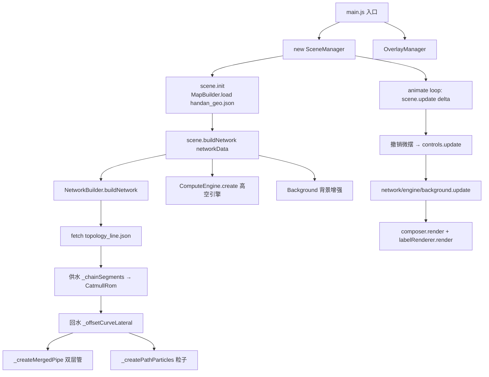

# 拓扑管网 3D 可视化大屏：科技感 Demo 的技术解析（地图 + 拓扑 + 3D 空间）

> 一个**纯 `Three.js（r160 ES Module）+ ECharts`** 驱动的科技感 3D 可视化 Demo。本文拆解它的整体架构与 7 个核心技术点，所有代码片段均可直接复制复用。

***

**效果图**：


*   GitHub 仓库：<https://github.com/weiweiweigang/topo-big-screen1>
*   在线 Demo：<https://weiweiweigang.github.io/topo-big-screen1/>

## 一、项目背景与定位

这是一套**以科技感与炫酷视觉为第一目标**的 3D 数据大屏 Demo：在真实地理底图之上，叠加供热管网拓扑与 3D 空间管路，呈现"地图 + 拓扑 + 3D"一体的可视化效果。

它的定位很明确——**一个可复用的效果合集**，而不是某个特定工业系统的前端。你看到哪段效果合适（比如双层光晕管道、对向粒子流、相机微摆、高空引擎扫描），直接把对应代码复制走即可。

*   技术底座：真实邯郸市行政区划 GeoJSON + 136 段真实管网拓扑（Web Mercator 坐标）
*   视觉要素：深色科技风、发光管网、流动粒子、高空计算引擎扫描、辉光后处理
*   性质：纯前端 Demo，无后端依赖，改一行就能本地预览

***

## 二、技术栈与整体架构

### 2.1 模块职责划分

| 模块                    | 文件                        | 职责                              |
| --------------------- | ------------------------- | ------------------------------- |
| **SceneManager**（编排者） | `three-scene.js`          | 舞台搭建 + 每帧编排，调度其余所有业务模块，**不写业务** |
| **NetworkBuilder**    | `NetworkBuilder.js`       | 站点节点、真实管道曲线、流动粒子、告警/呼吸动画        |
| **ComputeEngine**     | `computeEngine/index.js`  | 高空实时计算引擎 + 定时扫描特效 + 方案切换（编排类）   |
| **MapBuilder**        | `map.js`                  | GeoJSON 区县挤出、边界发光线、坐标投影工具       |
| **Background**        | `background.js`           | 渐变底色 + 发光网格 + 漂浮粒子              |
| **OverlayManager**    | `overlay.js`              | 浮层面板（指标/告警/图表/详情弹窗）             |
| **数据层**               | `data.js` + `data/*.json` | 站点/告警数据、拓扑线、行政区划 GeoJSON        |
| **入口**                | `main.js`                 | 初始化、异步加载、动画循环                   |

### 2.2 生命周期与数据流



关键设计：**`SceneManager` 只"搭台 + 报幕"，把构建（build）与每帧推进（update）委托出去**。每个子模块拿到 `scene / camera / controls` 引用，自己管理自己的 Mesh 与动画，互不耦合。

### 2.3 场景编排者

`SceneManager` 在构造时一次性初始化场景、相机、渲染器、标签渲染器、控制器、灯光、后处理、拾取，并把业务模块注入：

```js
// three-scene.js（节选）
this.network = new NetworkBuilder(this.scene, this.camera, this.controls);
this.engine  = new ComputeEngine(this.scene, this.controls);
```

每帧只做四件事——撤销上一帧相机微摆、更新控制器、推进业务动画、渲染：

```js
update(delta) {
  if (this._lastSway) { /* 撤销上一帧微摆偏移 */ }
  this.controls.update();
  if (!this._userInteracting) { /* 叠加相机微摆 */ }
  this.network.update(delta);
  this.engine.update(delta);
  if (this.background) this.background.update(delta);
  this.composer.render();
  this.labelRenderer.render(this.scene, this.camera);
}
```

***

## 三、核心技术点深挖

### 3.1 真实管网拓扑的曲线化

原始数据是**离散的管道段**（每段有 `connId1 / connId2` 端点 id 和首尾坐标）。要画一条连续的流体管道，得先把段"串"成一条路径，再做平滑。

**供水：按连接关系链段 + Catmull-Rom 平滑**

```js
// NetworkBuilder._chainSegments（节选思路）
// 1. 用 connId 建立索引：哪些段接在端点 A、端点 B
// 2. 找起点：connId1 没出现在任何段的 connId2 中
// 3. 正向追踪 + 反向追踪，拼出有序段序列
// 4. 取每段的端点生成有序点列
return new THREE.CatmullRomCurve3(points, false, 'catmullrom', 0.3);
```

**回水：复用供水曲线，固定方向偏移**

回水管道和供水几乎平行，但**不能逐点做管线的法向偏移**——拐弯处相邻段的法向突变会让回水曲线"扭曲/自交"。项目用了一个很稳的近似：**用整条曲线的首尾连线算一个全局侧向方向，整体平移**。

```js
// NetworkBuilder._offsetCurveLateral
_offsetCurveLateral(curve, lateralOffset, yOffset) {
  const pts = curve.points;
  const up = new THREE.Vector3(0, 1, 0);
  // 整条曲线整体走向
  const overallDir = new THREE.Vector3()
    .subVectors(pts[pts.length - 1], pts[0]).normalize();
  // 走向 × up = 固定的侧向法线方向
  const fixedNormal = new THREE.Vector3()
    .crossVectors(overallDir, up).normalize();

  const offsetPoints = pts.map(p => new THREE.Vector3(
    p.x + fixedNormal.x * lateralOffset,   // 侧向 0.8
    yOffset,                                // 降低 Y 0.3
    p.z + fixedNormal.z * lateralOffset
  ));
  return new THREE.CatmullRomCurve3(offsetPoints, false, 'catmullrom', 0.3);
}
```

> **经验**：当"平行偏移"在局部会自交时，退一步用全局方向偏移，牺牲物理精确换视觉稳定，对大屏完全够用。

### 3.2 双层管渲染与透明排序

一条管道要同时具备"实体感"和"科技光晕感"，还要让粒子在管中流动可见。最终方案是**三层叠加**：

| 层   | 几何                       | 材质                                                                   | renderOrder | 作用   |
| --- | ------------------------ | -------------------------------------------------------------------- | ----------- | ---- |
| 内层管 | `TubeGeometry(r=0.08)`   | `MeshStandardMaterial` 不透明、发光、`depthWrite:false`                     | 5           | 管道实体 |
| 外壳  | `TubeGeometry(r=0.3)`    | `MeshBasicMaterial` 半透明(opacity 0.1)、`depthWrite:false`、`DoubleSide` | 10          | 光晕   |
| 粒子  | `SphereGeometry(r=0.15)` | `MeshBasicMaterial`、`depthWrite:false`                               | 5           | 流动介质 |

```js
// 内层（管道实体）
const innerMesh = new THREE.Mesh(
  new THREE.TubeGeometry(curve, tubularSegments, 0.08, 8, false),
  new THREE.MeshStandardMaterial({ color:0x1a2a44, emissive: color,
    emissiveIntensity: 0.5, metalness: 0.8, roughness: 0.3,
    transparent: true, opacity: 1.0, depthWrite: false })
);
innerMesh.renderOrder = 5;

// 外壳（光晕，不写深度避免遮挡粒子）
const outerMesh = new THREE.Mesh(
  new THREE.TubeGeometry(curve, tubularSegments, 0.3, 12, false),
  new THREE.MeshBasicMaterial({ color, transparent:true, opacity:0.1,
    depthWrite:false, side: THREE.DoubleSide })
);
outerMesh.renderOrder = 10;
```

**为什么要手动控 `renderOrder` 并关 `depthWrite`？**
透明物体的默认深度排序在管网这种"互相穿插 + 半透明壳"的场景下必定出错。项目的约定是：

    区县面 (depthWrite:false, renderOrder:0)
      → 管道内层 + 粒子 (renderOrder:5)
        → 管道外壳 (renderOrder:10)

即：**先画底层半透明区县（不写深度）→ 再画管道与粒子 → 最后画最外层光晕壳**。配合全链路 `depthWrite:false`，半透明之间不再互相"吃掉"对方，辉光也始终罩在最外。

### 3.3 粒子流对向动画

供水与回水要呈现"对向流动"。粒子沿 `CatmullRomCurve3` 用 `getPointAt(t)` 取位置，`t` 在 `[0,1]` 循环：

```js
// NetworkBuilder._createPathParticles + update（节选）
this.particles.forEach(p => {
  if (p.userData.reverse) {            // 回水：t 递减
    p.userData.t -= p.userData.speed;
    if (p.userData.t < 0) p.userData.t += 1;
  } else {                             // 供水：t 递增
    p.userData.t += p.userData.speed;
    if (p.userData.t > 1) p.userData.t -= 1;
  }
  p.position.copy(p.userData.curve.getPointAt(p.userData.t));
});
```

因回水曲线是供水曲线的偏移副本，两者共享同一套参数空间，`t` 同向即同路径、反向即"迎面而来"，视觉上天然形成环路对流。

### 3.4 呼吸 / 告警动画的 smootherstep 缓动

首站发光、告警脉冲这类"柔和起伏"没有用简单的 `sin`，而是套了一层 **smootherstep**——零阶/一阶/二阶导数在端点都为 0，过渡比 sin 更"稳"，不会有突变感：

```js
// NetworkBuilder.update（节选）
const breathTime = performance.now() * 0.003;          // ~2 秒周期
this.breathingObjects.forEach(obj => {
  let t = (Math.sin(breathTime + (obj.phase || 0)) + 1) * 0.5; // 0→1
  t = t * t * t * (t * (t * 6 - 15) + 10);             // smootherstep
  if (obj.isOpacity)
    obj.mat.opacity = obj.baseOpacity + obj.amplitude * t;
  else
    obj.mat.emissiveIntensity = obj.baseEmissive + obj.amplitude * t;
});
```

告警脉冲环则是 `sin` 直接驱动缩放 + 透明度：

```js
const time = performance.now() * 0.003;
this.alarmObjects.forEach(obj => {
  if (obj.type === 'ring') {
    const scale = 1 + Math.sin(time) * 0.3;
    obj.mesh.scale.set(scale, scale, 1);
    obj.mesh.material.opacity = obj.baseOpacity * (0.5 + Math.sin(time) * 0.5);
  }
});
```

### 3.5 相机微摆与 OrbitControls 的"共生"

大屏静止时希望相机有轻微"呼吸式"晃动增加生命力；但用户一旦拖拽，就必须立刻停摆、且**绝不能破坏用户的 OrbitControls 状态**。

最巧妙的是这段"先撤销、再交给控制器、最后叠加"的逻辑：

```js
// three-scene.js SceneManager.update（节选）
update(delta) {
  // ① 撤销上一帧的微摆偏移，让控制器基于"干净位置"计算
  if (this._lastSway) {
    this.camera.position.x -= this._lastSway.x;
    this.camera.position.y -= this._lastSway.y;
    this.camera.position.z -= this._lastSway.z;
  }
  // ② 控制器更新（阻尼、用户拖拽都在这步生效）
  this.controls.update();

  // ③ 未交互时叠加微摆；交互时清空缓存
  if (!this._userInteracting) {
    const t = performance.now() * 0.00105;     // ~6 秒周期
    const sx = Math.sin(t) * 2.0;
    const sy = Math.sin(t * 0.7) * 1.0;
    const sz = Math.cos(t) * 2.0;
    this.camera.position.x += sx;
    this.camera.position.y += sy;
    this.camera.position.z += sz;
    this.camera.lookAt(this.controls.target);
    this._lastSway = { x: sx, y: sy, z: sz };   // 记录本次偏移，供下帧撤销
  } else {
    this._lastSway = null;
  }
  // ...
}
```

**为什么能"共生"而不打架？**

*   每帧先把上一帧的偏移**减回去**，控制器永远在"无微摆"的基准位姿上工作，用户的拖拽/缩放不会被叠加量污染；
*   微摆量每帧记录、下帧撤销，形成"净零"回路；
*   交互检测用 `controls` 的 `start/end` 事件 + 2 秒空闲计时：拖拽期间 `_userInteracting = true` 直接跳过叠加，松手 2 秒后才恢复微摆。

### 3.6 高空计算引擎：编排模式与预设切换

"实时计算引擎"模块用**组合预设**管理复杂度：引擎本体 / 向下流光 / 扩散光圈三要素各有多套实现，按 `1/2/3/4` 整体切换。

```js
// computeEngine/index.js（节选）
// 三要素各有多套方案，按组合预设切换
//   1 稳·现状   → A+A+A     2 干净锐利 → D+D+C
//   3 数据流动   → C+C+D     4 扫描雷达感 → E+B+B
setPreset(n) {
  if (!PRESETS[n]) return;
  this.scheme = PRESETS[n];
  this._disposeEngine();                       // 销毁旧引擎（dispose 几何/材质/标签）
  this.engineGroup = new THREE.Group();
  this.engineGroup.position.set(this._cx, this._cy, this._cz);
  this._buildEngine(this.scheme.engine, this.engineGroup);  // 按新方案重建
  // 重建标签 + 清空进行中扫描特效
}
```

`_buildEngine` 把具体构造委托给 `engines/reactor.js / points.js / fresnel.js / morph.js`，`_triggerScan` 委托给 `scan.js`——**编排类只调度、不实现**，切换方案时整组销毁重建，杜绝旧方案的网格/粒子残留。其中方案 E 的"多态核心"还能在每次扫描脉冲时切到下一形态（立方晶阵→二十面体→八面体→魔方循环），用 smoothstep 做形态间融合过渡。

### 3.7 后处理辉光与拾取交互

**辉光**用 `UnrealBloomPass` 给所有发光材质统一"泛光"，科技感的主要来源：

```js
// three-scene.js _initPostProcessing
this.composer = new EffectComposer(this.renderer);
this.composer.addPass(new RenderPass(this.scene, this.camera));
this.composer.addPass(new UnrealBloomPass(
  new THREE.Vector2(w, h), 0.6 /* strength */, 0.5 /* radius */, 0.15 /* threshold */
));
this.composer.addPass(new OutputPass());
```

**拾取**用 `Raycaster` 命中节点或管道的交互代理（供水管道每段一个不可见 `TubeGeometry` 代理，`opacity:0` 供点击）：

```js
// three-scene.js _initRaycaster（节选）
const targets = [...this.network.nodeMeshes, ...this.network.pipeMeshes];
const intersects = this.raycaster.intersectObjects(targets, true);
// 向上回溯到带 userData.nodeData / pipeData 的祖先
```

命中后通过 `scene.onNodeClick` 回调把数据交给 `OverlayManager` 弹出详情面板，ECharts 图表也由它负责渲染。

***

## 四、总结与可扩展方向

这套大屏的架构可以浓缩成一句话：**`SceneManager` 搭台报幕，业务模块各管一摊，靠 import 链把场景基础设施与业务构建解耦。**

值得复用的几个模式：

1.  **编排者模式**：把"场景基础设施"和"业务构建/动画"彻底分离，子模块拿引用、自管理；
2.  **全局方向偏移代替逐点法向**：平行管线在转弯处的稳定方案；
3.  **`renderOrder` + `depthWrite:false` 三段式**：半透明层级场景的排序铁律；
4.  **相机微摆的"净零回路"**：先撤销→控制器更新→再叠加，与 OrbitControls 无冲突共存；
5.  **组合预设 + 整体销毁重建**：多方案可视化切换的干净做法。

可继续扩展的方向：

*   接入自己的数据源：替换 `data/topology_line.json` 与 `data/handan_geo.json`，把 `networkData` 换成你的拓扑/节点数据；
*   用 `InstancedMesh` 替代逐粒子 `Mesh`，把 25×N 个粒子压成一个 draw call；
*   把 `lngLatToScene` 抽成通用投影层，支持多城市切换。

***

## 五、源码与在线预览

*   GitHub 仓库：<https://github.com/weiweiweigang/topo-big-screen1>
*   在线 Demo：<https://weiweiweigang.github.io/topo-big-screen1/>
*   行政区 GeoJSON 数据来源（可下载全国/各省区县边界）：<https://datav.aliyun.com/portal/school/atlas/area_selector>

> 这是一个纯前端 Demo，无后端依赖。看到哪段效果合适，直接把对应模块的代码复制走即可。

***

*代码仓库即本体，所有示例均可在 `topo-big-screen1` 项目中找到对应实现。*
